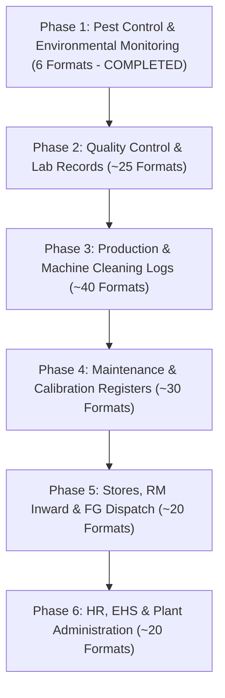

# Digital Controlled Records — Future Expansion Roadmap
**Strategy to Scale from Phase 1 Prototype to 141 Controlled Formats**

> This file extends the roadmap the company originally supplied (`FUTURE_ROADMAP.md` upload) with
> a concrete account of what Phase 1 actually delivered and exactly how the next formats plug in.
> The original strategy/phasing below is preserved as supplied.

---

## 0. What Phase 1 delivered (Pest Control, this build)

- 6 digitized document kinds / 10 configured `DocumentDefinition` rows (2 recurring formats with
  real Format/Rev numbers, 4 Service Report variants, GAP, Training, Chemical Master, SOP).
- The full Document → Frequency → Date → Record model, a working frequency engine (Daily,
  Fortnightly, Quarterly, As Required all exercised), record lifecycle with validation gates, Demo
  Mode with strict Live/Demo separation, 7 reports, CSV export, print, search, and a Master Data
  screen.
- A **document-template registry** (see DATA_MODEL.md §"Document-template architecture") designed
  specifically so the next formats are mostly *configuration*, not new code — this section is the
  concrete "how" for the phased rollout below.
- **Second batch (Sep-2026):** 7 more `DocumentDefinition` rows from "Audit documents.zip" — five
  lamination QC / production registers through the new generic **`log-sheet`** kind (a layout entry
  each, zero new components — this is the Phase 2/3 "numeric tolerance / pass-fail band" building
  block the sections below asked for) and two Statements of Compliance with validity tracking.
- **The assistant**: every due record is pre-filled from the user's last real record / the source
  specimen, and a login briefing tells the user what's ready, what needs them, and what's coming.
  For the remaining ~120 formats this means the "configure fields" step gains one more line —
  say which columns are readings (band), set-points (carry forward) or signatures.

## 1. The Core Architecture Principle

The Pest Control prototype establishes the foundational pattern for the remaining 140+ formats:
1. **Master Data Registry**: Factory premises, equipment IDs, shifts, chemicals, personnel.
   *(Built: `frontend/src/data/seed/masterData.ts` + Master Data screen.)*
2. **Standardized Execution Checklists**: Fixed checkpoints with mandatory deviation-handling logic.
   *(Built: Daily Monitoring's 10-checkpoint model, with note-required-on-flag logic — reusable
   as-is for any other checklist-shaped format.)*
3. **Traceable Sequential Numbering**: `PREFIX-YYYY-SEQ#` (e.g. `PRD-2026-0001`, `QC-2026-0001`).
   *(Not built yet — an earlier unused `recordNumber()` / `nextSequence()` scaffold was removed in the
   Sept-2026 dead-code cleanup; add it back alongside the first format that actually displays a number.)*
4. **Electronic Verification Workflow**: `Draft` → `Pending Verification` → `Verified` / `Rejected`.
   *(Built: the full lifecycle in `engine/recordLifecycle.ts`, generic over any document kind.)*
5. **Integrated Non-Conformance (CAPA)**: Any failed checkpoint directly triggers an open action
   item with due date and owner. *(Built for Pest Control: Daily Monitoring flags findings and
   prompts a Summary-of-Actions row; GAP module is a full standalone CAPA tracker with automatic
   Overdue computation. The same `GapInspectionData` shape can front any other module's corrective
   actions — no new type needed.)*
6. **Segregated Audit Trails**: Immutable log of every event. *(Partially built: every record
   stamps `createdAt/updatedAt/submittedBy/submittedAt/verifiedBy/verifiedAt/rejectedBy/rejectedAt`,
   plus `prepared` when the assistant filled it in. A separate immutable event log is the concrete
   Phase 2 task; see §3.)*

---

## 2. Phased Rollout Plan across Departments

### Adding a format in Phase 2+ — the concrete steps this codebase expects

1. **Analyze** the source document (photograph/scan/DOCX/XLSX) the same way REQUIREMENTS.md does
   for Pest Control: title, Format No., Rev No., frequency, every field, every table, response
   vocabulary, signature/verification fields. Write it up the same way — one section per document,
   ending with an explicit TO BE CONFIRMED list. Do not guess.
2. **Classify** against the existing `DocumentKind`s:
   - Shape-compatible with an existing kind (another checklist-grid like Daily Monitoring; another
     multi-line service/inspection report like Service Report) → **add one `DocumentDefinition`
     row only**, with a new `variantKey` if needed. Zero new components.
   - Genuinely new shape (e.g. a lab test result with numeric tolerances and pass/fail bands) →
     add one new `DocumentKind`, one new payload type in `frontend/src/types/record.ts`, one new
     `frontend/src/components/records/<Name>RecordView.tsx` built from the same shared primitives
     (`DocumentHeader`, `.doc-table`, `StatusBadge`, `RecordActionBar`).
3. **Create Template**: the `DocumentDefinition` row (Format No., Rev No., department, module,
   description, `sourceFile`).
4. **Configure Frequency**: pick the right `ScheduleConfig` variant (`daily` / `weekly` /
   `fortnightly` / `monthly` / `quarterly` / `yearly` / `as-required`) — the frequency engine
   requires zero code changes for a new document using an existing cadence shape.
5. **Configure Fields**: default-data factory in `engine/recordDefaults.ts` (what's
   auto-populated) + validation rules in `engine/validation.ts` (what's required to Submit/Verify).
6. **Configure Workflow**: usually nothing — the lifecycle state machine is generic. Only add a
   `case` to `validateForSubmit`/`validateForVerify` if the format has real extra requirements
   (like Service Report's customer-signature-to-verify rule).
7. **Deploy**: no build/deploy changes — new formats ship in the same static bundle.

### Phase 2: Quality Assurance & Laboratory (Next Priority)
* **Target Records**: Incoming raw material inspection reports, print quality pull tests, GSM
  verification, shade-matching approvals.
* **Reusable Foundations**: Area master, employee directory, audit trail engine, verification
  modals — all already built and generic in this codebase.
* **New work needed**: a numeric-tolerance/pass-fail field type (Daily Monitoring's checkpoint
  model only supports OK/NOT OK/Yes/No/number — lab tests need "value vs. spec range → automatic
  Pass/Fail", a small, contained addition to the checkpoint response-type union).

### Phase 3: Production & Machine Logs
* **Target Records**: Line clearance checklists, printing plate mounting logs, daily machine
  startup checks, cylinder inspection sheets.
* **Value Add**: Direct barcode scanning of plate/cylinder numbers to eliminate handwriting —
  pairs naturally with the PC-ID-style master-data-lookup pattern already used for Fly Catcher.

### Phase 4: Maintenance & Calibration
* **Target Records**: Equipment preventive maintenance schedules, weighing scale calibration logs,
  fly killer machine maintenance.
* **Value Add**: Automated recurring schedule engine that creates draft due tasks automatically —
  this is exactly `ensureRecordsGeneratedForMonth()`, already built and generic.

---

## 3. Production Infrastructure Recommendations

* **Database**: Migrate from `localStorage` (this prototype) to containerized PostgreSQL for
  high-concurrency multi-tablet input. The storage-adapter seam for this migration is documented
  in DEPLOYMENT.md — it is a scoped, mechanical change.
* **Authentication**: ~~Today's "Acting as" name selector in the top bar is a placeholder for
  this~~ — **done at a basic level**: `backend/` is a small Express + SQLite (`node:sqlite`)
  service issuing real accounts (signup/login, bcrypt-hashed passwords, JWT session cookie); the
  top bar now shows the logged-in user and every lifecycle action records their real identity
  (`submittedBy`/`verifiedBy`/`rejectedBy`), not a free-text dropdown. Still open: corporate LDAP /
  Active Directory or SSO (OAuth2 / SAML) instead of local accounts, and role-based access control
  actually gating pages/actions (today `role` — `admin`/`staff` — is issued and displayed but
  nothing is restricted by it yet).
* **Signatures**: Digital signatures compliant with 21 CFR Part 11 / ISO 9001 guidelines (password
  confirmation on verify).
* **Audit log** — *done (Sep-2026)*: every record carries an append-only history of each edit
  (field, before → after), submit, verification, rejection and correction, shown as its Record
  history (`engine/recordHistory.ts`). Next: move it server-side with the records, so it can't be
  altered from a browser.
* **Offline PWA Support**: Service Worker caching for plant floor tablets operating in shielded
  factory zones — the frontend is static assets (only login and the assistant need the API), so
  this is a small addition (a service worker + a Web App Manifest) rather than an architecture change.
* **Rebuild with the originally-preferred toolchain**: once this project is opened in a normal,
  networked environment, run `npm install` to pull in Vite/Tailwind/react-router-dom/Zustand and
  follow the swap table in DEPLOYMENT.md — every substitution made here is isolated to one file.
